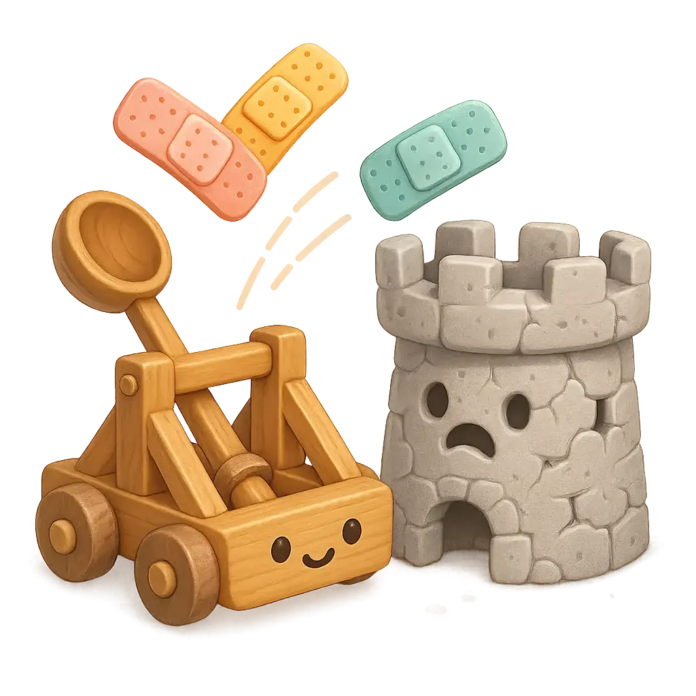

# AIMER Product: AI-Assisted Product Development Prompts

<div align="center">
    
</div>

## The Challenge

How can we streamline and improve product development using AI assistance?

AIMER Product tackles this question by providing **structured prompt templates** and **systematic workflows** for product development. We're inspired by proven methodologies such as:

- **Jobs-to-be-Done (JTBD)** framework for understanding user needs
- **Lean Product Development** principles for rapid iteration and validation
- **Human-Centered Design** practices for creating meaningful experiences

These aren't just prompts – they're distilled frameworks based on solid foundations from industry expertise and proven practices for product development.

### What We Want to Achieve

We want to create a comprehensive toolkit that supports product managers, developers, and designers in building better products by guiding Large Language Models (LLMs) through structured product development workflows.

This repository contains prompt templates for Claude Code that implement key product development methodologies. Each command represents a specific analytical methodology designed to systematically examine different aspects of your product: from understanding user jobs and creating personas to mapping user journeys and generating implementable user stories.

### But We Need Your Help!

Product development is complex and contextual. Products serve different users, solve different problems, and operate in different markets. To generate valuable insights, LLMs need to:

- Understand user needs and motivations deeply
- Connect business goals to user value
- Navigate complex stakeholder requirements
- Generate actionable development plans
- Maintain consistency across the entire product development lifecycle

This is more than prompt engineering — it's about designing a structured approach that guides how an LLM thinks about product development challenges.

### How You Can Help

This is an open challenge and an evolving community effort.

We welcome contributions such as:

- Designing prompts that operationalize product development techniques
- Proposing workflows that connect different product development stages
- Sharing real-world cases that stress-test our templates
- Exploring integrations with existing product development tools

We believe AI can become a true partner in product development — not by replacing human judgment, but by scaling and systematizing our product expertise.

## Current Status

We're working in public to explore what's currently possible with AI-assisted product development together with you!

For this, we've created several commands for Claude Code and are using a lightweight process, mapped to three directories:

- `ideas`: Early-stage prompts and concepts for product development workflows. Some suggestions may not make sense yet and might not be possible to implement with today's technologies, but we'll refine and filter them over time. See the contents of this directory more like an initial brainstorming.

- `experiments`: More developed ideas and commands we're actively testing for product development workflows. They're absolutely not production-ready, but first product teams are working on those to evolve them into something that could actually work. Here we especially welcome discussions and feedback to improve their robustness and usefulness.

- `prod`: Stable prompts that work reliably and help with product development tasks, especially in real-world product development scenarios from idea to implementation.

Depending on your goals, copy the commands you want to work on into Claude Code's `commands` directory or add new ideas directly to the repository with a Pull Request.

For detailed workflow instructions and step-by-step guidance, see our [**HOWTO.md**](HOWTO.md) guide.

## Current Usage Scenarios

We're using Claude Code as starting point for our first experiments in this area to avoid creating something that will be obsolete with the next iteration of AI assistants.

You may use these prompts wherever you like.

We'll document a way to use them as [custom slash commands in Claude Code](https://docs.anthropic.com/en/docs/claude-code/tutorials#create-custom-slash-commands):

### A. Use commands within a single project / repo (Recommended)

To make AIMER Product prompts available within a specific project or repository you have two options:

#### Option A.1: Git Submodule (Recommended)

Adding AIMER Product as a Git submodule allows you to track specific versions and update more easily:

##### A.1.1 Add the repository as a submodule in your project

Navigate to your project root and execute:

```bash
mkdir -p .claude/commands
git submodule add https://github.com/innoq/aimer-product.git .claude/commands/aimer-product
```

##### A.1.2 Update the submodule when needed

```bash
git submodule update --remote .claude/commands/aimer-product
```

#### Option A.2: Direct Clone

Create a simple clone of the current state of the AIMER Product repository

##### A.2.1. Clone this repository into your project's `.claude/commands` directory

```bash
# Navigate to your project root
mkdir -p .claude/commands
git clone https://github.com/innoq/aimer-product.git .claude/commands/aimer-product
```

#### Executing commands

You can execute the commands with a starting `/`. The AIMER Product commands will reflect the file names of the prompt templates.

Take a look at the suffix of the command's description to see in which stage the command is (e.g. `(project:ideas)`) before using it.

### B. Use commands User-wide

Instead making a copy / clone to a specific project dir, you can also put AIMER Product into your user's home directory:

```bash
mkdir -p ~/.claude/commands
git clone https://github.com/innoq/aimer-product.git ~/.claude/commands/aimer-product
```

#### Executing commands

You can execute the commands with a starting `/`. The user-wide AIMER Product commands will have the suffix `(user)` (as other existing user commands will, too). Unfortunately, you won't see in which state the current command is. Therefore, this usage variant isn't recommended currently.

## Usage Tips

**💡 Important Hint**: All AIMER Product prompts are designed for **thinking mode (reasoning)** or, if not using Claude, models that can do chain-of-thought reasoning. For optimal results, append terms like "think", "think harder", or "ultrathink" to your slash commands. For some prompts, thinking mode is not activated, so remember to explicitly enable it for deeper, more thorough analysis.

- Command names are derived from the filename (e.g., `create_prd.md` becomes `/create_prd`)
- You can organize prompts in subdirectories for better categorization
- Project-scoped commands are shared with team members who have access to the repository
- User-scoped commands are available to you across all projects
- All prompts use `$ARGUMENTS` to accept additional contextual information as parameter to `claude` on the CLI

### Using Thinking Mode (Reasoning)

All AIMER Product commands include a `$ARGUMENTS` placeholder that allows you to pass additional instructions to enhance Claude's analysis. One powerful use case is enabling **thinking mode** to get deeper, more thorough analysis.

#### Examples

**Basic command:**

```
claude > /create_prd
```

**With thinking mode for deeper analysis:**

```
claude > /create_prd think
claude > /create_prd think harder
claude > /create_prd ultrathink
```

**Other useful argument patterns:**

```
claude > /create_user_story think and focus on mobile user experience
claude > /jtbd_workflow think and prioritize B2B use cases
claude > /create_proto_persona think especially about accessibility needs
```

## Categories

- **Product Strategy**: Prompts for product vision, strategy, and roadmap planning
- **User Research**: JTBD analysis, persona creation, and user journey mapping
- **Development Planning**: User stories, backlog generation, and implementation planning
- **Documentation**: Templates for generating product requirements and technical documentation

## Getting Started

For a comprehensive guide to using AIMER Product workflows, including detailed step-by-step instructions, methodology backgrounds, and usage recommendations, see our [**HOWTO.md**](HOWTO.md) guide.

## Contributing

Contributions are welcome! When creating or modifying prompts, please follow our [Prompt Guidelines](prompt-guideline.md) to ensure consistency and quality across all AIMER Product commands.

Please feel free to submit a pull request with new prompts or improvements to existing ones.

## Maintainers

- [Roman Stranghöner](https://www.innoq.com/en/staff/roman-stranghoener/)
- [Robert Glaser](https://www.innoq.com/en/staff/robert-glaser/)

## License

See the [LICENSE](LICENSE) file for details.

---

Built with ❤️ by humans and machines at [INNOQ](https://www.innoq.com).

<a href="https://www.innoq.com">
    
</a>
